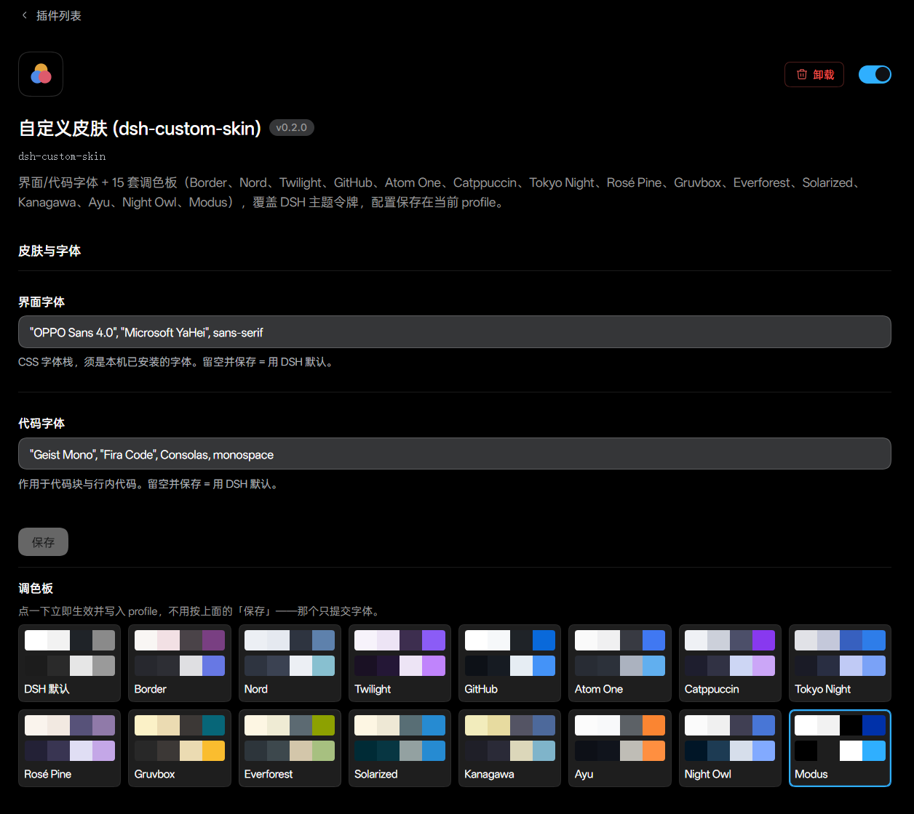

# dsh-custom-skin

DeepSeek Harness（DSH）Web GUI 插件：自定义 **界面字体 / 代码字体**，以及 **24 套调色板**。
配置坐在 DSH 统一的 **插件 → 已安装插件 → dsh-custom-skin** 页面里，值存进当前 profile。

- 改字体：覆盖 `--dsw-font-family`、`--ds-font-family-code`
- 选皮肤：`ctx.theme.overrideTokens` 覆盖 14 个 DSH 主题令牌（light/dark 成对）+ Markdown 美化 CSS
  （标题色条、强调/公式/行内代码/引用样式，选择器与当前 DSH 构建一致）
- 调色板点一下即时生效并写盘；两个字体字段走官方暂存-保存流，「保存」按钮就紧跟在字体下面
  （色卡排在表单框之外，否则会被读成"选完还要按保存"）
- 顺带修掉 DSH 宽表格 hover 抖动（与皮肤无关，任何主题下都生效，见文末）



## 安装

从 GitHub（推荐）：

```bash
dsh plugin --profile web add github:v587d/dsh-custom-skin
```

本地开发（改代码即时映射，不用重新 add）：

```bash
dsh plugin --profile web add link:/绝对路径/到/本仓库
```

安装完成后重启：

```bash
dsh web
```

> 安装命令会把插件自动加入 `dsh.profile.bundles`（reconcile 检测到
> `package.json` 里的 `dsh.bundle.patch` 声明），无需手动改配置。
> 卸载：`dsh plugin --profile web remove dsh-custom-skin`。
> 验证：重启后左上角 插件 → 已安装插件 里 **dsh-custom-skin** 详情页出现「皮肤与字体」配置段，
> 或 `grep dsh-custom-skin ~/.dsh/profiles/web/package.json`。

> 兼容性：DSH **0.2.0-rc.2** 实测通过（`package.json` 的
> `dsh.compatibility.dshReleases` 记录在案）。0.1.x 也能装，但 0.1.x 没有
> `plugins.bundle.config` 槽，配置卡片不出现——字体/皮肤仍按已存的 profile 值生效。

## 使用

1. Web UI 左上角 **插件 → 已安装插件 → dsh-custom-skin**
2. **界面字体 / 代码字体**：填本机已安装的字体栈，例如
   - UI：`"OPPO Sans 4.0", "Microsoft YaHei", sans-serif`
   - Code：`"Geist Mono", "Fira Code", Consolas, monospace`
   清空并保存 = 回到 DSH 默认（字段显示「已覆盖」徽标 = 当前值来自 profile 而非默认层）。
3. **调色板**：点色卡选皮肤，第一格 `DSH 默认` = 完全不动 DSH 自带主题。
   色卡上排是浅色方案、下排是深色方案，四个色块依次是 底色 / 抬升面 / 正文 / 强调色。

配置写进 profile 文档（`~/.dsh/profiles/web/cordis.patch.yml` 的 user 层），
**跟着 profile 走而不是跟着浏览器走**：同一 profile 换个浏览器登录，皮肤一样。

## 皮肤

| 皮肤 | 浅色方案 | 深色方案 | 色表出处 | 上游许可 |
|---|---|---|---|---|
| Border | ✓ | ✓ | [dsh-refined](https://github.com/djh2203/dsh-refined) | MIT |
| Nord | ✓ | ✓ | [arcticicestudio/nord](https://github.com/arcticicestudio/nord) | Apache-2.0 |
| Twilight | ✓ | ✓ | dsh-refined（Dracula 系强调色） | MIT |
| GitHub | ✓ | ✓ | dsh-refined | MIT |
| Atom One | ✓ | ✓ | dsh-refined | MIT |
| Catppuccin | Latte | Mocha | [@catppuccin/palette `palette.json`](https://github.com/catppuccin/palette/blob/main/palette.json) | MIT |
| Tokyo Night | Day | Night | [folke/tokyonight.nvim `extras/lua`](https://github.com/folke/tokyonight.nvim/tree/main/extras/lua) | Apache-2.0 |
| Rosé Pine | Dawn | Moon | [rose-pine/vscode `themes/*.json`](https://github.com/rose-pine/vscode/tree/main/themes) | MIT |
| Gruvbox | hard-light | hard-dark | [morhetz/gruvbox `gruvbox_256palette.sh`](https://github.com/morhetz/gruvbox/blob/master/gruvbox_256palette.sh) | 上游仓库无 LICENSE 文件 |
| Everforest | medium-light | medium-dark | [sainnhe/everforest `autoload/everforest.vim`](https://github.com/sainnhe/everforest/blob/master/autoload/everforest.vim) | MIT |
| Solarized | Light | Dark | [altercation/solarized `solarized.vim`](https://github.com/altercation/solarized/blob/master/vim-colors-solarized/colors/solarized.vim) | MIT |
| Kanagawa | Lotus | Wave | [rebelot/kanagawa.nvim `lua/kanagawa/colors.lua`](https://github.com/rebelot/kanagawa.nvim/blob/master/lua/kanagawa/colors.lua) | MIT |
| Ayu | Light | Dark | [ayu-theme/ayu-colors `ayu` (npm)](https://github.com/ayu-theme/ayu-colors) | MIT |
| Night Owl | Day Owl | Night Owl | [sdras/night-owl-vscode-theme `themes/*.json`](https://github.com/sdras/night-owl-vscode-theme/tree/main/themes) | MIT |
| Modus | Operandi | Vivendi | [protesilaos/modus-themes `modus-themes.el`](https://github.com/protesilaos/modus-themes/blob/main/modus-themes.el) | **GPL-3.0** |
| Dracula | Alucard | Dracula | [dracula/dracula-theme `README`](https://github.com/dracula/dracula-theme#color-palette) + [dracula/cursor `dev/src/alucard.yml`](https://github.com/dracula/cursor/blob/main/dev/src/alucard.yml) | MIT |
| Monokai | Monokai Light | Monokai | [ku1ik/vim-monokai `colors/monokai.vim`](https://github.com/ku1ik/vim-monokai/blob/master/colors/monokai.vim) + [zoxon/vscode-theme-monokai-light](https://github.com/zoxon/vscode-theme-monokai-light/blob/master/themes/Monokai%20Light%20Theme-color-theme.json) | MIT（两支都是） |
| Noctis | Noctis Lux | Noctis | [liviuschera/noctis `themes/{lux,noctis}.json`](https://github.com/liviuschera/noctis/tree/master/themes) | MIT |
| Material | Lighter | Default | [k-i-o/vsc-safe-material-theme `dist/themes/*.json`](https://github.com/k-i-o/vsc-safe-material-theme/tree/master/dist/themes) | MIT（原作者仓库已删除） |
| Horizon | Horizon Bright | Horizon | [jolaleye/horizon-theme-vscode `src/{bright,dark}/globals.json`](https://github.com/jolaleye/horizon-theme-vscode/tree/master/src) | MIT |
| Vitesse | Light | Dark | [antfu/vscode-theme-vitesse `themes/*.json`](https://github.com/antfu/vscode-theme-vitesse/tree/main/themes) | MIT |
| PaperColor | light | dark | [NLKNguyen/papercolor-theme `colors/PaperColor.vim`](https://github.com/NLKNguyen/papercolor-theme/blob/master/colors/PaperColor.vim) | MIT |
| Iceberg | light | dark | [cocopon/iceberg.vim `colors/iceberg.vim`](https://github.com/cocopon/iceberg.vim/blob/master/colors/iceberg.vim) | MIT |
| Seoul256 | seoul256-light | seoul256 | [junegunn/seoul256.vim `colors/seoul256.vim`](https://github.com/junegunn/seoul256.vim/blob/master/colors/seoul256.vim) | MIT（仅文件头与 README 声明，仓库无 LICENSE 文件） |

前 5 套移植自 [dsh-refined](https://github.com/djh2203/dsh-refined)（上游只有这 5 套，没有更多可取）；
第 6～15 套（Catppuccin 起）与第 16～24 套（Dracula 起）的色值逐个从各自上游的官方色表取，
并用脚本比对回原文件核对过（每个十六进制值都能在拉下来的上游文件里找到），不是凭空配的。

> **许可**：本仓库整体是 MIT，但上表右两列是**配色方案的出处与上游许可**——这里搬运的是
> 十六进制色值表（数据），不是上游的代码或字体文件。三点需要留意：Modus 的上游是 GPL-3.0，
> Gruvbox 与 Seoul256 的上游仓库里没有 LICENSE 文件（Seoul256 只在 README 和色文件头声明 MIT）。
> 如果你要 stricter 的处理，删掉这几行对应的 `THEMES` 条目即可，插件其余部分不受影响。

取色时的几个具体决定：
Tokyo Night 的 day 方案在 nvim 上游是运行时反算的（`colors/tokyonight-day.lua` 只做
`Util.invert`），所以这里用的是同仓库**已固化导出**的 `extras/lua/tokyonight_day.lua`。
Everforest 取的是 **medium** 档（上游另有 hard/soft 两档，背景色不同）。
Kanagawa 的 wave/lotus 角色映射按 `themes.lua` 的 `ui.bg / bg_p1 / bg_p2 / fg / fg_dim`。
Modus 用官方两档 Operandi（`#ffffff`）/ Vivendi（`#000000`），不带 tinted/deuteranopia/tritanopia 变体。
Ayu 的色值来自官方 `ayu` npm 包的静态表（`surface.* / editor.* / ui.* / syntax.*`）；该包没有
`common.accent`，强调色取其签名橙 `#FF8F40` / `#FA8532`。
Night Owl 的浅色是上游的 Day Owl（`Night Owl-Light-color-theme.json`）；它的抬升面取
`editor.selectionBackground #1D3B53`——社区图里常见的 `#112240` 在主题 JSON 中其实不存在。

这一批（Dracula 起）新增时踩到的坑，记下来免得下次再踩：

- **Dracula 的浅色是官方的 Alucard**（draculatheme.com/pro 说的 "a light variant"），
  且十六进制表就公开在 MIT 的 `dracula/cursor` 里，所以不用自己配深色反算浅色。
  深色的侧栏底 `#21222C` 取的是官方 `dracula/alacritty` 的 ANSI black（README 色表里没有这一项）。
- **Monokai Pro 是付费且明确禁止再分发**（monokai.pro/licence），所以深色用 MIT 的
  `ku1ik/vim-monokai` 经典表、浅色用 MIT 的 `zoxon/vscode-theme-monokai-light`，
  完全不碰 Pro 的 filter 表。
- **Material 的原仓库 `equinusocio/vsc-material-theme` 已被删除**，而几个 Apache 社区 fork 的
  `themes/*.json` 是 OpenSSL 加密的 base64（当年收费解锁那件事的遗留），读不出色值；
  这里用的是明文且 MIT 的 `k-i-o/vsc-safe-material-theme`。VS Code 系的浅色档叫 **Lighter**
  （Paler/Higher/Larker 是 Sublime 那边的名字）。Lighter 的 `foreground #90A4AE` 在
  `#FAFAFA` 上只有约 2.6:1，所以正文主色取同仓库 Default 的 `#263238`（Blue Grey 900），
  `#90A4AE` 降为次要文字。
- **Horizon 找不到 Hotwired 的原始仓库**（`branchio/`、`oliverbw/`、`dbaskette/`、`jasonm23/`
  全部 404），现存各移植都署名 `jolaleye/horizon-theme-vscode`（MIT），浅色档叫 **Horizon Bright**。
- **Seoul256 的色值是间接的**：文件里高亮组给的是 256 色索引，需按同文件的默认 `s:rgb_map`
  解析（`g:seoul256_srgb` 会换一张表），这里用的是默认表；深色底 `#4B4B4B`(237) 是它
  本来的中灰，不是打错。
- **Vitesse** 上游所有 chrome 面都等于 `editor.background`，没有第二层；抬升/浮层取它自己的
  `-soft` 变体底色（`#F1F0E9` / `#222222`）。深色的 `foreground #dbd7caee` 带 alpha，
  这里落成 `#DBD7CA`。
- **浅色模式的浮层底色**（`toastBg`）上游若没有单独定义，统一取 `#FFFFFF`，与既有各套一致。

评估过但**没有**采纳的，理由都是「装进来就是个重复色卡或没有合法浅色」：

- **One Half**：它的深/浅值与已有的 Atom One 基本逐字相同（同一支 Atom One 家族，
  `#282C34 / #E06C75 / #98C379 / #61AFEF / #C678DD`），等于多放一个长得一样的色卡。
- **Synthwave '84**：`robb0wen/synthwave-vscode` 只贡献一支 `vs-dark` 主题，
  上游没有浅色（搜 daywave 也是 0 结果），凑不出 light/dark 成对值。
- **Bluloco**：上游 LICENSE 是 **LGPL-3.0**，而且它深色的 chrome（`#282C34 / #ABB2BF`）
  又和 Atom One 撞了。
- **Winter is Coming**：深色底 `#011627` 与已有的 Night Owl 相同。

社区另有 `math-lrz/dsh-theme-pack`（16 套）之类现成的 DSH 皮肤包，色表来源与授权难以逐条
核实，故未采用。

## 注意

- **字体必须已安装在操作系统里**，插件不打包字体文件
- 其他主题/皮肤插件若也写同一批 CSS 变量，后加载的会盖掉先加载的
- 卸载插件后 profile 里的配置仍会留着，删掉 `cordis.patch.yml` 里 `custom-skin` 那颗行的
  `config:` 即可；浏览器侧的 `localStorage['dsh-custom-skin.v1']` 只是首屏缓存，可直接清

## 开发注意事项（重要）

### 配置为什么是「host 声明 schema，浏览器读写」

DSH 0.1.7 起 `dsh-settings` 不再接受 `settings.register()`，而是把**活动 profile 条目**
`Config` schema 里标了 `.volatile()` 的字段投影成表单，命名空间**恒等于条目 id**。所以：

- `lib/index.js`（host 半边）导出 `Config`，三个字段全标 `.volatile()`；
  `apply()` 是空的——本插件不消费自己的配置，皮肤全在浏览器侧落色。
- ⛔ **漏标 `.volatile()` 后果静默**：一个 volatile 字段都没有时 `volatileForm()` 返回
  `undefined`，条目不进 describe 镜像，配置段**直接消失**（零报错）；写非 volatile
  路径则抛 `Config field "…" is not volatile`。
- `cordis.patch.yml` 的行 id 就是命名空间，别改。

### 两个字符串，别混

| 常量 | 值 | 钉在 | 漂移表现 |
|---|---|---|---|
| `ENTRY_ID` / `SETTINGS_ENTRY_ID` | `custom-skin` | `cordis.patch.yml` 行 id、host `Config`、`configForms.get()/whileServed()` | 卡片静默消失 |
| `BUNDLE_NAME` | `dsh-custom-skin` | 槽 `plugins.bundle.config` 的 key（host 按 `{entryKey: pkg.name}` 渲染），必须逐字等于根 `package.json` 的 `name` | 卡片静默消失 |

### 槽与注册形状

`plugins.bundle.config` 是 **keyed** 槽，descriptor 只收 `name / key / locale / inject /
children / store / registrant`——**不接受 `id`/`order`/`label`/`icon`**（那是 list 槽的字段）。
注册要包在 `configForms.whileServed([ENTRY_ID], …)` 里，host 没装配这个条目时不留痕迹：

```js
ctx.configForms.whileServed([ENTRY_ID], () =>
  ctx.slots.inject('plugins.bundle.config', () =>
    ctx.slots.register({ name: 'plugins.bundle.config', key: BUNDLE_NAME, locale: LOCALE_NS,
      inject: () => card.inject() }, Card)))
```

`settings.section`（0.1.x 的老位置）在 0.2.0 **仍然存在**，但插件配置已统一到插件页；
本插件不再注册它。`settings.plugin.item` 在 0.2.0 不存在（只在 dsh-context 的编译产物里
还有残留），往未声明的槽注册会**抛错**。

### inject 有两处、写法不同

- bundle 内插件对象的 `inject` 用**服务 key**：`['slots', 'theme', 'locale', 'configForms']`
  （fiber 靠它在 ctx 注册表里等服务；写包名会永远 pending，启动页报
  "waiting for services: @deepseek-ai/…"；声明了 host 不提供的服务键同样会 pending）。
- `package.json` 的 `dsh.client.inject` 用**包名**，仅用于 boot 清单预取/排序。
  0.2.0 的提供方：`slots` ← `@deepseek-ai/dsh-client-ui-renderer`、`theme` ←
  `@deepseek-ai/dsh-client-ui-theme`、`configForms` ← `@deepseek-ai/dsh-client-ui-settings`。
  写旧包名不报错，代价是丢掉「提供方先于本插件加载」的排序保证。

### 首屏不能闪，老配置不能丢

`configForms` 的快照要等 host 往返才 `ready`，所以浏览器侧留了一份
`localStorage['dsh-custom-skin.v1']`：`apply()` 先用它 paint 一次，快照 `ready` 后以
host 值为准重绘并 write-through。**host 是唯一权威**，缓存只负责第一帧不闪默认主题。

0.1.x 的用户配置只在 localStorage 里、profile 条目是空的，升级后会被画回 schema 默认
（选过 Nord 的人会莫名变成 GitHub）。所以 `apply()` 里有一次性迁移：快照首次 `ready` 时，
若 `snapshot.user` 为空（= profile 从没存过任何字段）且 localStorage 有值，就把**与解析后
默认值不同的那几个字段**写进 profile，并跳过这一次绘制（写入会再通知一次，避免闪默认）。
三种情形都验过：升级 → 只补写有差异的字段；profile 已有配置 → 一个字节都不写；
全新安装（无缓存）→ 不写。刻意重置过的用户不会被"复活"，因为那时缓存已被重置值覆盖。

### 其它

- **`lib/client.js` 必须是「经典脚本」，不能含顶层 `export`/`import`**。DSH 用
  `<script src>` 加载 client bundle，文件里出现 `export` 会直接
  `SyntaxError: Unexpected token 'export'`，整个插件加载失败。正确形态：
  `window.__ModuleLoader__.load({ id: 'dsh-custom-skin', factory: (require) => { … return module.exports } })`，
  `id` 必须等于包名。
- 主题走 `ctx.theme.overrideTokens('custom-skin', { '--dsw-alias-xxx': { light, dark } })`，
  不要手写 `:root` 覆盖颜色令牌。每个值**必须**是 `{light, dark}` 成对——传裸字符串
  会 `TypeError`。`overrideTokens` 按 source 替换图层，切皮肤不必先 dispose 再设。
  `buildTokens` 只输出 **Theme inspect provider 当前列出的可覆盖令牌**，0.2.0-rc.2 是
  14 个：`bg-base` / `bg-layer-1` / `bg-layer-2` / `bg-overlay` / `border-l1` / `border-l2` /
  `brand-primary` / `label-primary` / `label-secondary` / `state-error-primary` /
  `state-idle-primary` / `state-success-primary` / `state-warn-primary`（皆 `--dsw-alias-` 前缀）
  + `--dsw-specific-sidebar-fill`。`--dsw-alias-bg-layer-3`、`--dsw-alias-label-tertiary`、
  `--dsw-alias-markdown-*` 等虽在设计令牌表里，但不在可覆盖清单内，写了也不生效
  （想扩展先查 provider 的最新清单）。
- 官方表单件在 `@deepseek-ai/dsh-client-ui-primitives`：`SettingsForm`（只读/不可用/
  保存态外框）、`SettingsFormModel` + `settingsTextField`（暂存-保存流）、
  `SettingsValueField`（单字段）。**没有 select/色卡类控件**，调色板选择器是自己画的
  （`.dcs-*` 类，样式全取 `--dsw-alias-*`，所以色卡本身也跟着当前皮肤走）。
- 插件页的标题/描述/图标由 `dsh-app-boot` 的 `readPluginMeta` 读：入口是
  `${包名}/locale/en.json`（所以 `package.json` 必须有 `exports["./locale/*.json"]`，
  没有 `locale/en.json` 就完全不扫元数据），图标取 `package.json` 的 `icon`
  （包内相对路径、SVG/PNG/JPEG/WebP、≤256 KiB）。
- **宽表格抖动修复（主题无关，总是生效）**：DSH 对 ≥4 列的宽表格（`.md-table-wide`）
  平时 `overflow-x:hidden` + `padding-bottom: var(--dsh-scrollbar-width, 5px)`，hover /
  focus-visible 时切到 `overflow-x:scroll` 并清零 padding。hover 的高度补偿只在表格
  **实际溢出**且滚动条占用空间时成立；表格装得下时 hover 会直接塌缩那个 reserve，
  鼠标在表格底边反复进出 → 页面抖动。DSH 构建从不定义
  `--dsh-scrollbar-width`，恒走兜底值。插件在 `applySkin` 中**无条件**输出两条修复：
  ① 发布 `:root { --dsh-scrollbar-width: <实测值>px }`（探针实测水平滚动条高度，
  悬浮滚动条系统为 0，供 DSH 及 dsh-context 等消费）；
  ② 用 `!important` 把 `.md-table-wide` 三态（常态/hover/focus-visible）固定为
  `overflow-x: auto` + `padding-bottom: 0`——滚动条常驻、无 hover 依赖的 padding，
  任何溢出与否、任何滚动条尺寸下高度都恒定（与 DSH 对小表格 `.tableFill` 的做法一致）。
  代价：宽表格的横向滚动条不再"hover 才出现"，而是常驻可见。类名 `md-table-wide`
  与令牌名 `--dsh-scrollbar-width` 与 DSH 构建耦合，升级 DSH 后需复查
  （0.2.0-rc.2 已复查：两者都在，只是兜底值 8px → 5px、hover 用 `scroll`）。
  0.2.0-rc.2 的 A/B 实测：撤掉本插件的固定规则 → 常态 177px（`hidden` + `padding-bottom:5px`）
  / hover 172px（`scroll` + `0`），**抖 -5px**；装回 → 常态/hover/focus-visible 三态恒 172px。
  同理 `[class*="_markdown_"]` 与 `body[data-ds-dark-theme]` 两个选择器也要复查
  （0.2.0 的 `MarkdownText.module.css` 仍有局部类 `.markdown`，CSS Modules 生成的
  `_markdown_<hash>` 依旧命中）。
- `lib/index.js` 里 `import '@deepseek-ai/schemastery'` 必须走 **peerDependencies**，不要写成
  `dependencies`：`link:` 安装不会把被链接包自己的 dependencies 落到 profile 的 `node_modules`
  里，写死依赖会让条目在**全新/独立 profile** 里静默 `failed to import`（宿主只打印一行
  `custom-skin: failed to import`，卡片和皮肤全都不出现）。本机 web profile 之所以"看起来正常"，
  是因为同 profile 里的 dsh-context / capital-generation 也声明了这个包，被顺带供进了模块解析——
  属于巧合，不是保证。改成 peer 后，空 profile 只装本插件也能激活（已实测）
- 改完 `lib/client.js` 后无需重装，重启 `dsh web` 即可（bundle 内容 hash 变化会自动换 rev）。

## 目录

```
dsh-custom-skin/
├── package.json         # dsh.client.inject / icon / locale exports / compatibility
├── cordis.patch.yml     # 行 id: custom-skin ≡ settings 命名空间
├── icon.svg             # 插件页图标（≤256 KiB，包内相对路径）
├── locale/{en,zh}.json  # 插件页标题/描述（meta.*）
├── assets/setting.png   # README 截图
├── lib/
│   ├── index.js         # host 半边：Config schema（三个 .volatile() 字段）
│   └── client.js        # 浏览器半边：THEMES + 应用样式 + 插件页配置卡片
└── README.md
```

## 版本

`0.3.0` — 调色板 15 → 24 套（新增 Dracula/Alucard、Monokai、Noctis、Material、Horizon、
Vitesse、PaperColor、Iceberg、Seoul256），浅色 shorthand `#FFF` 统一成 6 位十六进制。
`0.2.0` — 配置搬到 DSH 0.2.0 统一的插件页（`plugins.bundle.config`）、持久化改走
`configForms`/profile（含从 0.1.x localStorage 的一次性迁移）、皮肤 5 → 15 套、
补齐 0.2.0 新增的 4 个 state 令牌。
`0.1.x` — `settings.section` 时代，值存 `localStorage`。

发 GitHub 前自查（都过）：`node --check lib/client.js`、`node --check lib/index.js`、
`node -e "import('./lib/index.js')"`（host 半边能 import 且 `Config` 通过 `dsh-settings`
的 `volatileForm` 投影）、`lib/client.js` 顶层无 `export`/`import`（经典脚本约束）、
24 套皮肤的字段完整性与色值格式校验，以及「每个十六进制值都能在拉下来的上游色表文件里找到」
的回溯比对（漏一个就报错）。

## License

MIT
